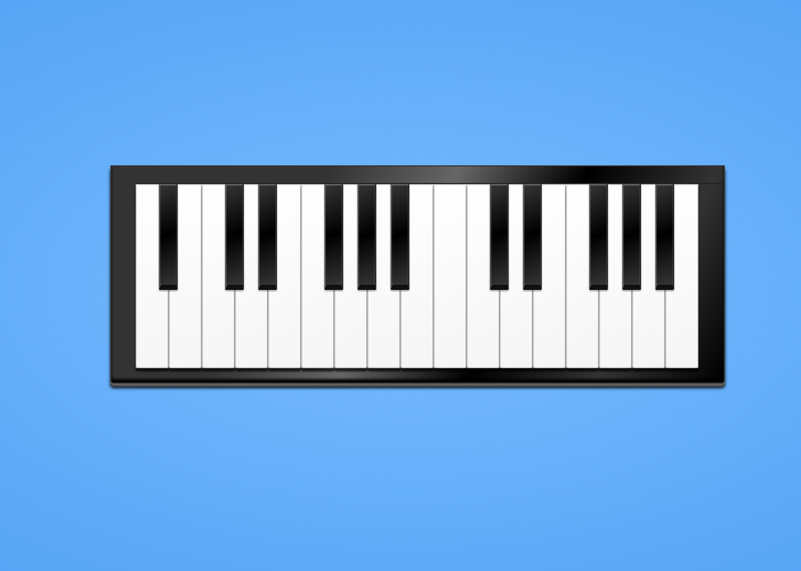

# Making a Collaborative Piano Using Functional Reactive Programming (FRP)

To learn more about functional reactive programming, I started
making a simple collaborative piano using JavaScript/CoffeeScript. 
This blog post shows how Functional Reactive Programming can make the 
task of taking multiple event inputs and merging them into one discrete 
sequence of interactions really easy – a task that could otherwise be 
potentially complex and very unstructured/hard to read.

## Background

Functional Reactive Programming (FRP) is a programming paradigm combining
functional and reactive programming. By using FRP one can use functional
programming _reacting_ on either continuos or discrete signals in 
sequence and be declarative rather than imperative. FRP is not a new concept, 
and as far as I can tell it stems from a system developed by 
Conal Elliot and Paul Hudak in 1997 called FRAN. FRAN was a collection of 
functions and data types for composing interactive animations [1].

In FRP we operate with two different terms; behaviours and events.
A behaviour is a continuous set of values, like a mouse movement or time,
and events are sequences of discrete values such as clicks, keystrokes or 
web socket emits. Behaviours will always have a value, unlike events.

[Juha Paananen](https://twitter.com/raimohanska) (of 
[bacon.js](https://github.com/baconjs/bacon.js)) described FRP using an 
analogy to spreadsheets: In traditional programming if we define 
```a = b + c```, ```a``` will always be the sum of ```b``` 
and ```c``` in that given time, but in spreadsheets, if we have 
```a = b + c``` and either ```b``` or ```c``` changes, ```a``` will 
change accordingly. In this example, ```b```, ```c``` and the sum 
would be behaviours.

FRP lets us use map and filter on event streams and behaviour, 
just like we would on regular lists. Using functional programming techniques
we can generate results derived from immutable behaviours, events or a set of either
behaviours or events. One can merge or combine signals, transform, delay and
much more in a declarative manner. By being able to combine different signals
we can build complex structures and functionality from lesser complex building
blocks.

The reactive nature of FRP, is perfect for doing UI interaction and/or 
animation, be it input from form fields, clicks, key presses,
scrolling or what have you. We'll see more about this when implementing the
collaborative piano.

## Implementing the Piano



The goal is to make a piano. The piano should make sound on mouse clicks and 
when the keyboard keys ```1``` through ```8``` is pressed. In addition, we 
will broadcast to other piano players what key we played. To keep it simple 
we won't have several channels, and no limitations of the number of players. 

We will be implementing a piano using CoffeeScript on the client side, and
a short server side implementation for handling WebSockets in Node.JS. 

For this example, [bacon.js](https://github.com/baconjs/bacon.js) will be used, 
but we could just as easily use something like [RxJS](https://github.com/Reactive-Extensions/RxJS).

In Bacon the behaviours are called Properties and events are called EventStreams.
Bacon has implementations for doing map, filter, merge, triggering actions, 
transforming events to behaviours (properties) and much more. For this example
we will only be using events; clicks, key press, web sockets.

For the actual piano-key to sound, a modified version of a open source library 
called [js-piano](https://github.com/michaelmp/js-piano) is used. The code is 
available as a gist here: https://gist.github.com/mikaelbr/6569804. The usage
looks like this ```player(key)``` where the key can be A2, E3, etc.

The markup is simple enough: an un-ordered list setting the piano keys as
data-note attributes, as shown here:

```html
<div id="p-wrapper">
  <ul id="piano">
    <li><div class="anchor clickable" data-note="A2"></div></li>
    <li><div class="anchor clickable" data-note="B2"></div><span></span></li>
    <li><div class="anchor clickable" data-note="C3"></div></li>
    <li><div class="anchor clickable" data-note="D3"></div><span></span></li>
    <li><div class="anchor clickable" data-note="E3"></div><span></span></li>
    <li><div class="anchor clickable" data-note="F3"></div></li>
    <li><div class="anchor clickable" data-note="G3"></div><span></span></li>
    <li><div class="anchor clickable" data-note="A3"></div><span></span></li>
    <li><div class="anchor clickable" data-note="B3"></div><span></span></li>
    <li><div class="anchor clickable" data-note="C4"></div></li>
    <li><div class="anchor clickable" data-note="D4"></div></li>
    <li><div class="anchor clickable" data-note="E4"></div><span></span></li>
    <li><div class="anchor clickable" data-note="F4"></div><span></span></li>
    <li><div class="anchor clickable" data-note="G4"></div></li>
    <li><div class="anchor clickable" data-note="A4"></div><span></span></li>
    <li><div class="anchor clickable" data-note="B4"></div><span></span></li>
    <li><div class="anchor clickable" data-note="C5"></div><span></span></li>
  </ul>
</div>
```

I like reading code as a learning tool, so for this blog post, we'll just see the
code with annotations describing the action taken. We'll take
each event at the time and gradually build our piano, starting with clicks, 
then moving on to key press and the web socket.

### Play sounds on click

```coffeescript
# Create event streams for clicks on the piano tuts.
clicks = $("#piano") # Fetch the piano-element
  .asEventStream("click", ".clickable") # Attach to click event as stream
  .doAction(".preventDefault") # Perform an action on the event signal
  .map (e) -> # Map events and retrieve the data-note
    $(e.currentTarget).attr "data-note"
```

As a result, we now have the event ```clicks```, which now contains a stream
of piano keys. We need to use this information some how. We can either add
subscribers (as with promises), or we can set an action to do on a value. For
our purpose, we only need to do an action on a new value.

```coffeescript
clicks.onValue player # where player is as defined player(key)
```

### Adding ```keypress``` Support

Let's create another event stream, for key press.

```coffeescript
# Listen for keypress on the document
keypress = $(document)
  .asEventStream("keypress") # Attach to keypress event as stream
  .map(".keyCode") # Extract keyCode
  .filter (code) ->  # Remove all signals that's not the keys 1 through 8
    code >= 49 && code <= 56
  .map (code) -> # translate to piano keys
    scale[code - 47]
```

The result, will as with the ```clicks``` event, be a stream of piano keys.

Now we need to ```merge``` these two streams, to play sound on both click 
and key press. Remove the previous onValue, and create a new stream that is a
merge of clicks and key presses.

```coffeescript
notes = clicks
  .merge(keypress) # merge keypress creating a new event
  .onValue(player) # play sound
```

Since all event streams are immutable they generate a new stream ```notes```.

### Appending Collaborative Functionality

We need a server side component to handle the web sockets. We'll do a quick implementation
using Node.js, ExpressJS and Socket.io:

```javascript
var express = require('express')
  , app = express()
  , server = require('http').createServer(app)
// Serve static files
app.use(express.static(__dirname + '/public'));

// Create WS server
var io = require('socket.io').listen(server);
// When a new client connects
io.sockets.on('connection', function (socket) {
  // Pass on the piano key as a broadcast
  socket.on('note', function (data) {
    socket.broadcast.emit('note', data);
  });
});

// Start server and listen on port 8080 if not env defined.
server.listen(process.env.PORT || 8080);
```

Now we know we can emit a key to the other clients, and receive keys.

Lets start by creating the event stream

```coffeescript
# Create event stream from target socket.
server = Bacon
  .fromEventTarget(socket, 'note') # Attach to WS event 'note'
  .filter (note) -> # Filter out non-keys
    $.inArray note, scale
```

Now we have three events to merge and play keys from. Let's rewrite 
the ```notes``` event.

```coffeescript
notes = clicks
  .merge(keypress)
  .merge(server) # Merge the new server event
  .onValue(player) # play all notes from all events
```

Now we can listen to other playing, but not emit what we are playing.
We need to emit keys from clicks and key presses, but not from the server.

```coffeescript
notes = clicks
  .merge(keypress) # Merge keypress
  .doAction (data) -> # Broadcast what key is playing
    socket.emit "note", data 
  .merge(server) # Merge server
  .onValue(player) # play all notes from all events
```

Now we have a fully functioning collaborative piano. We can click on it,
use the keys ```1``` through ```8```, and we can play tunes with other users. 

One thing is missing, though. We cannot see what tangent a key press is,
or what tangent other users are using. We have to set a tangent as active.

### Setting Tangents As Active

One big advantage with FRP, is the immutability. That is, each map, filter, or what
have you, returns a new event. This means that we can use ```keypress``` and ```server```
again, without having it alter our existing program. Lets add the active state:

```coffeescript
# Indicate tangent click on keypress/server
keypress # Use old event
  .merge(server) # merge server event
  .map (key) -> # Convert keys to jQuery objects of tangent
    $("[data-note='" + key + "']")
  .doAction (el) -> 
    el.addClass "active"
  .delay(200)  # wait for 200 ms before moving on
  .onValue (el) -> 
    el.removeClass "active"
```

# Final Result

The final coffeescript source can be seen as a gist: https://gist.github.com/mikaelbr/6570293
A demo can be found on heroku http://frppiano.herokuapp.com/

The full source code is available as a Github repo: https://github.com/mikaelbr/frp-piano


## More Detailed Reading

1. A tutorial in FRAN by Conel Elliot: http://conal.net/fran/tutorial.htm
2. Readme of Bacon.js: https://github.com/baconjs/bacon.js
3. FrTime: Funtional Reative Programming in PLT Sheme: ftp://ftp.cs.brown.edu/pub/techreports/03/cs03-20.pdf


[1]: http://conal.net/papers/icfp97/icfp97.pdf
